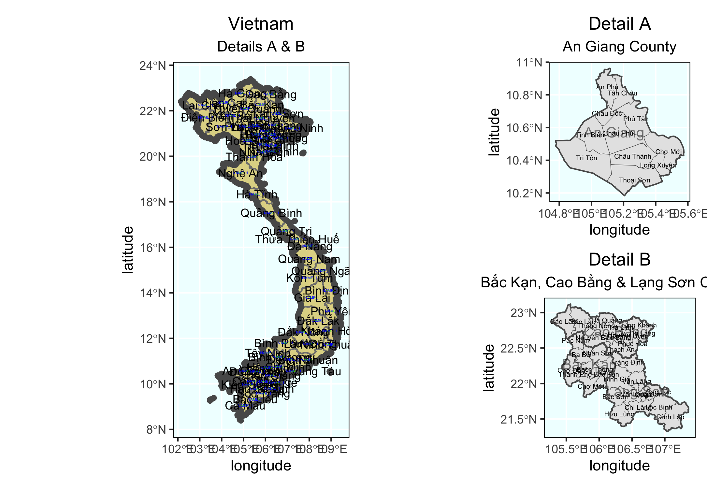
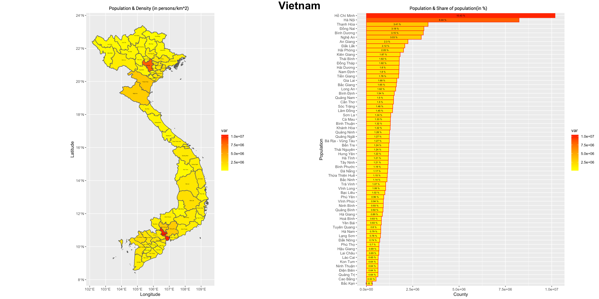
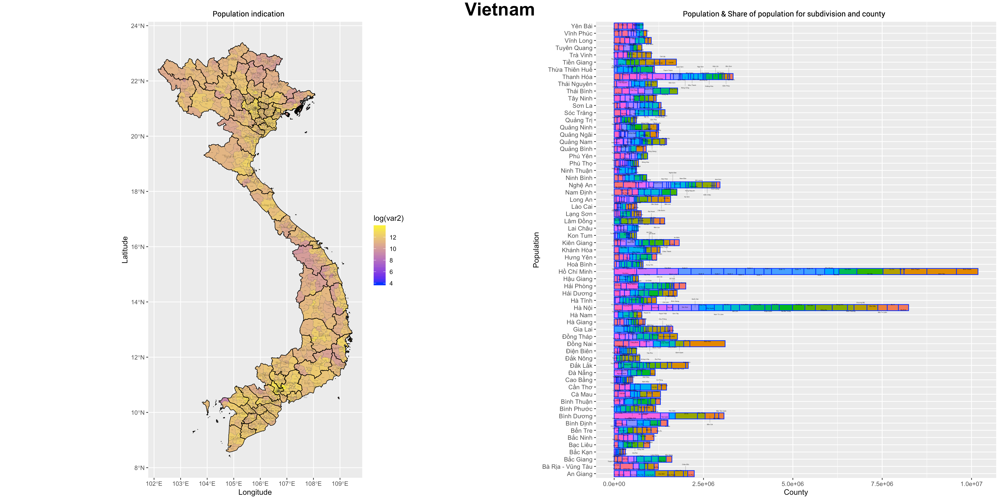
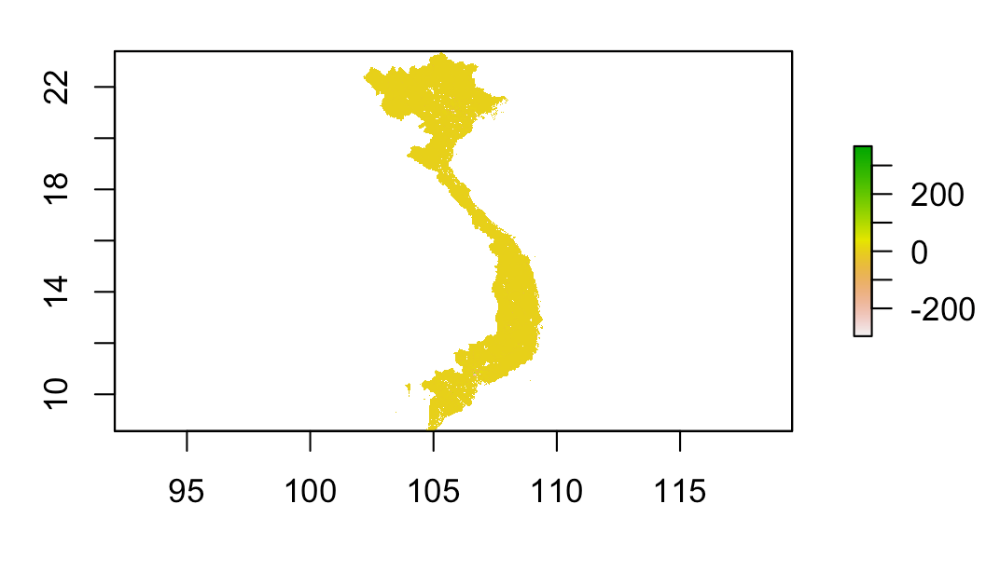
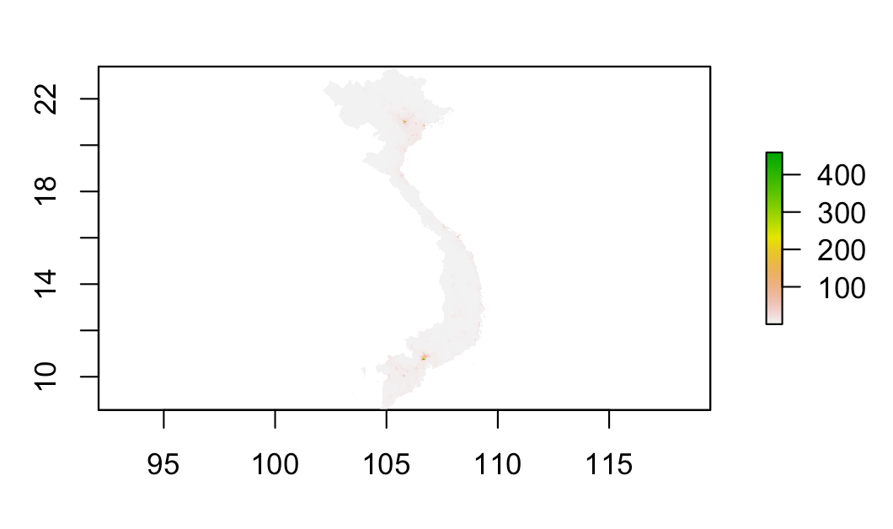
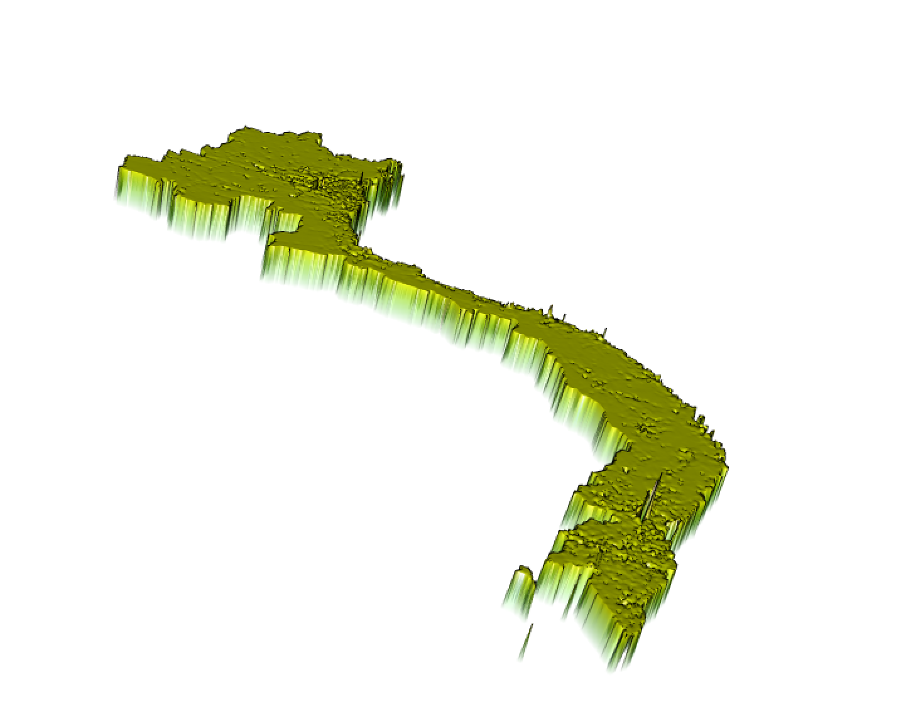

# Vietnam 

This is my final project on Vietnam. In the past semster, we generate more precise representation of Vietnam’s population and its distribution. Furthermore, we compared the distribution of urban areas with local topography, and analysis the correlation between local topography and the distribution of basic public facility.

## Administrative Subdivisions of Vietnam

Administrative Subdivisions of Vietnam(By County)
#
Vietnam has 63 counties, and 710 districts. Among these counties, the most populated one is Ho chi min city, and the population is 8.993 million people.

## Population of Vietnam's Counties

As we can see from the bar graph, Ho Chi Min City (Saigon) and Ha Noi appear to be more populated than the rest. Ha Noi is the political center of the country and Ho Chi Min City tends to be the financial centre. Vietnam is an agricultural based country, the least populated areas of Vietnam are mostly used for farming or mining. 

## Population of Vietnam's Districts

## 3D representation of population by department

The most populated counties in Vietnam is Ho chi Minh City, and the most populated district in Ho Chi Minh City is Binh Tan. Binh Tan tends to have more population than certain counties independent counties in Vietnam. 

When we re-generate population by objective factors such as topography or water distribution. The most accurate model among  three is the log model of the population. The absolute value of the difference between the world population from HDX and the log pop model prediction is the smallest. Although all of the data sets are similar, the log model is slightly better than the other two. 
## Population Log(pop)

