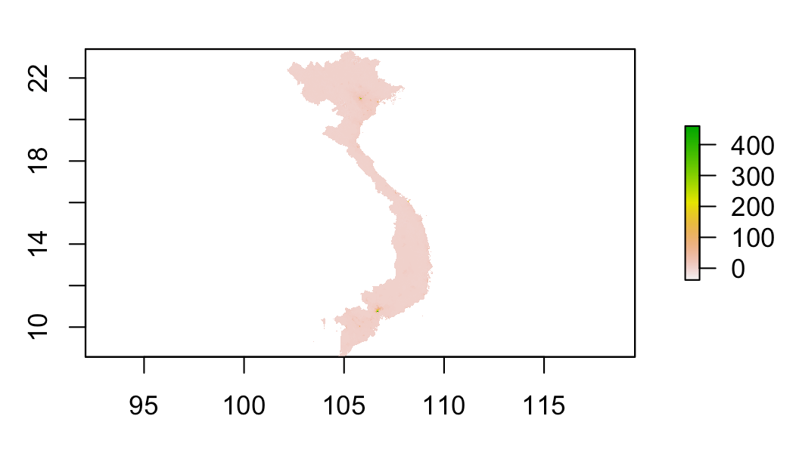
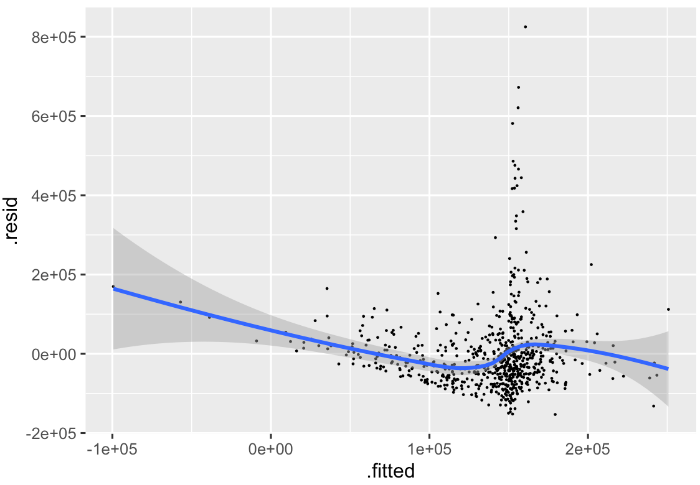
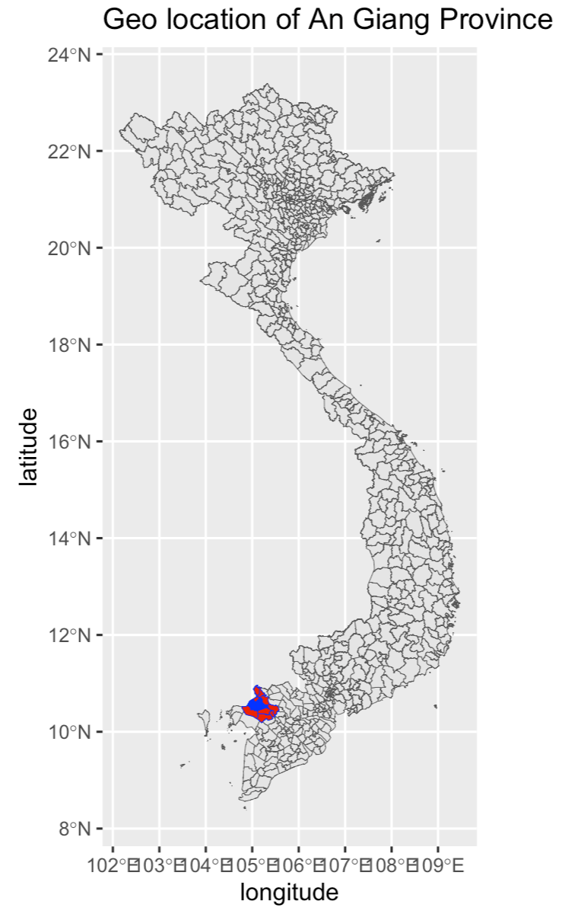
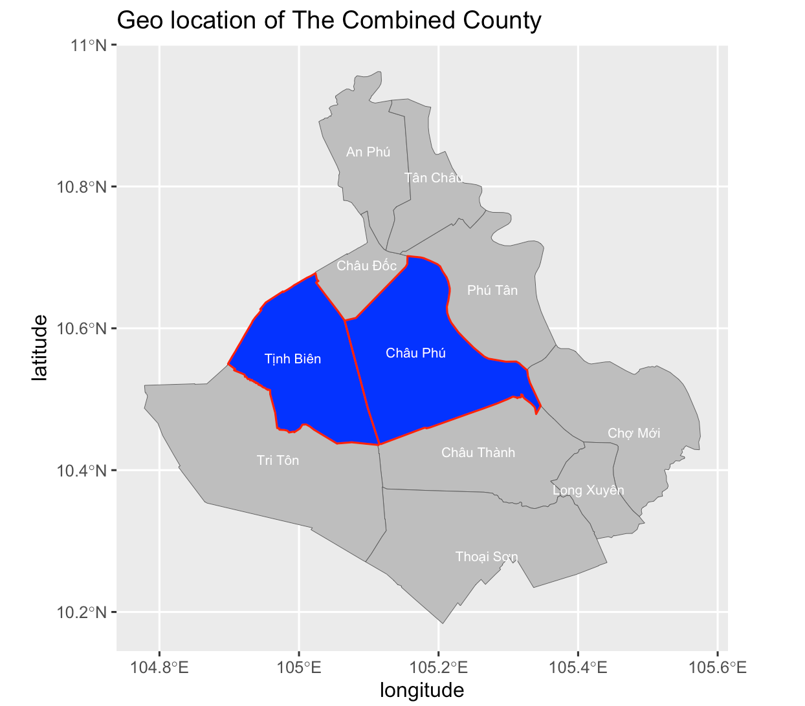
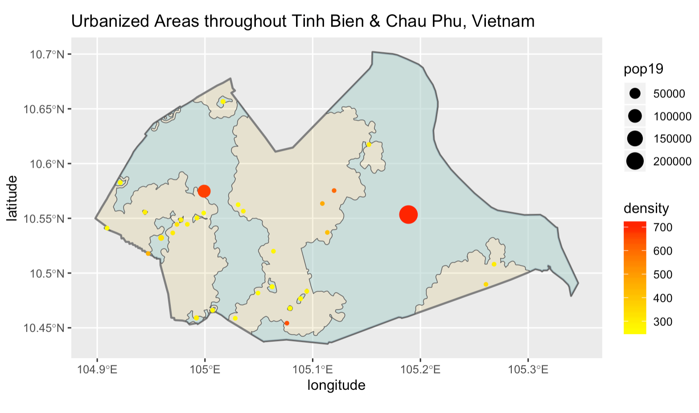
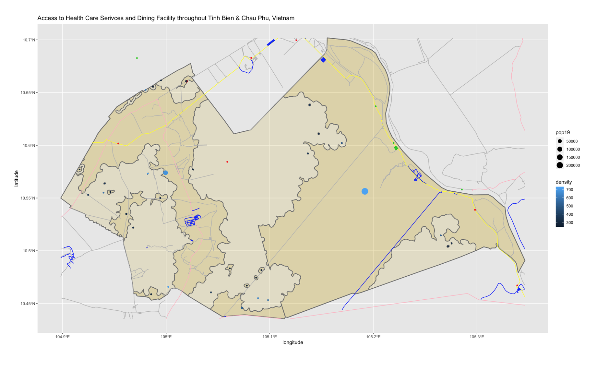

# Vietnam 

This is my final project on Vietnam. In the past semster, we generate more precise representation of Vietnam’s population and its distribution. Furthermore, we compared the distribution of urban areas with local topography, and analysis the correlation between local topography and the distribution of basic public facility.

## Administrative Subdivisions of Vietnam

Administrative Subdivisions of Vietnam(By County)
#
Vietnam has 63 counties, and 710 districts. Among these counties, the most populated one is Ho chi min city, and the population is 8.993 million people.

## Population of Vietnam's Counties

As we can see from the bar graph, Ho Chi Min City (Saigon) and Ha Noi appear to be more populated than the rest. Ha Noi is the political center of the country and Ho Chi Min City tends to be the financial centre. Vietnam is an agricultural based country, the least populated areas of Vietnam are mostly used for farming or mining. 

## Population of Vietnam's Districts

## 3D representation of population by department

The most populated counties in Vietnam is Ho chi Minh City, and the most populated district in Ho Chi Minh City is Binh Tan. Binh Tan tends to have more population than certain counties independent counties in Vietnam. 

When we re-generate population by objective factors such as topography or water distribution. The most accurate model among  three is the log model of the population. The absolute value of the difference between the world population from HDX and the log pop model prediction is the smallest. Although all of the data sets are similar, the log model is slightly better than the other two. 
## Population Log(pop)

Areas with the first and second high population are Hanoi and Saigon. One is the political center and the  other  is  the  commercial  center.  However,  the  sum  model  of  population  does  seem  to  be overestimate the population of the area compare to the other two graphs.
## Population Sum

With the data we extract from HDX, we could analyze the corelation between some varibles like topography and population. 
## Correlationship Pop19 & lights, urban cover, and bare cover

Population of Vietnam (Dependent variable) lights, urban cover, and bare cover (Independent variable)
#

##Urban Population
Now we can focus on An Giang which I introduced in the first graph as 'Detail A'
## Geographic location of An Giang

The coloered part is the An Giang county, then we narrow it down to two adjacent district--Chau Phu and Tinh Bien
## Geographic location of Chau Phu and Tinh Bien

The total population of my selected area is 378,956. Tinh Bien and Chau Phu are sub-provinces  of  the  county,  An  Giang.  Tinh  Bien  has  196,475  people  and  Chau  Phu has 182,481 people. There are 28 defined urban areas in total. Vietnam  has  a  very  special  population  distribution.  There  were  several  small areas  within  the  selected  county  that  have  a  relatively  high  population  which  causes the density of those areas to extremely high. In order to eliminate those areas, I looked into  the  density  column  and  sorted  it  by  population  density,  and  I  set  the  filter  at  a credible value to filter out the places with high density and small area.
## Correlationship Urban areas & population 

I mapped out primary, secondary, and unclassified roads. The blue line on the map is residence, the yellow line is primary road, the pink one is secondary road, and the grey one is unclassified road. Large amount of unclassified roads verified the basic transportation in Vietnam is motorcycle.I dotted the health facility(which includes hospital, dentist, clinic)  with  a  green  dot.  The  original  data  from  HDX  aren’t  applicable,  because  they show  that  there  are  only  162  hospitals  in  Vietnam  and  none  of  them  are  in  the  sub-provinces I selected. However, I searched on google and found out there are more than a dozen of the hospital in An Giang along. So I used the special open-spaced code on slack to find more health facilities on the map. Now, the green dots on the map are the health  facility,  the  red  dots  on  the  map  are  dining  services,  and  the  big  brown  dot  on the map is the pub. 
## distribution of Heath care service and dining facility in Tinh Bien and Chau Phu

