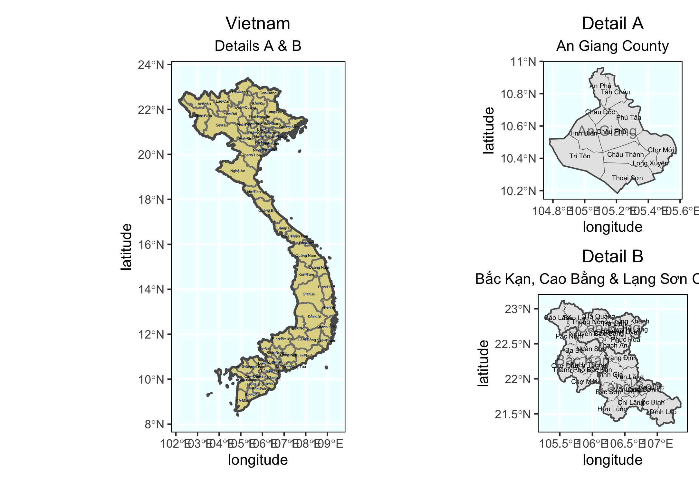

# Vietnam 

This is my final project on Vietnam. In the past semster, we generate more precise representation of Vietnam’s population and its distribution. Furthermore, we compared the distribution of urban areas with local topography, and analysis the correlation between local topography and the distribution of basic public facility.

## Administrative Subdivisions of Vietnam

Administrative Subdivisions of Vietnam(By province)/
Vietnam has 63 provinces, and 710 municipalities. Among these provinces, the most populated one is Ho chi min city, and the population is 8.993 million people.

## Population of Vietnam's Counties

## Population of Vietnam's Districts

